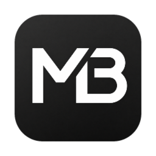

# Model Battle

**在一台 Mac 上，同时运行多个模型，把输出质量、耗时与 Token 用量放到同一界面比较。**

[产品简介](#intro) · [核心能力](#features) · [使用前准备](#requirements) · [下载安装](#install) · [开始使用](#usage) · [数据与隐私](#privacy)

---

## 产品简介

Model Battle 是一款面向 Apple Silicon Mac 的本地多模型对比工具。只需输入一次任务，即可并行调用多个同类型模型，在同一界面查看生成结果、运行耗时与 Token 用量，减少来回切换和手工整理。

应用支持 AIHubMix、硅基流动，以及自定义 OpenAI 兼容连接。你可以按任务选择文本、图片、音频或视频模型，并让同一组输入同时交给多个模型处理。

## 核心能力

- **一次输入，多模型并行**：统一发起任务，结果按模型分栏呈现。
- **覆盖四类生成任务**：支持文本、图片、音频与视频模型；音频包含文本转音频和音频转文本。
- **对比关键指标**：集中查看输出内容、运行耗时和可用的 Token 数据。
- **统一多媒体条件**：图片与视频可添加参考图，图片可设置生成比例，音频可统一选择音色。
- **系统提示词**：文本、图片、视频、音频转文本、文本转音频各自保存一条，随时开关状态一目了然。
- **灵活添加模型来源**：可从 AIHubMix、硅基流动加载模型，也可接入自定义 OpenAI 兼容模型。
- **随时结束运行**：不想继续等待时，可手动结束当前任务。

## 使用前准备

- Apple Silicon Mac（M 系列芯片）。
- macOS 14 或更高版本。
- 对应模型服务的 API Key。模型调用产生的费用由所使用的服务商收取。

## 下载安装

1. 下载最新的 [Model Battle v1.0.0 DMG 安装包](https://github.com/yuanhao667/model-battle/releases/download/v1.0.0/Model.Battle_1.0.0_aarch64.dmg)。
2. 打开 DMG，将 `Model Battle.app` 拖入“应用程序”文件夹。
3. 从“应用程序”中打开 Model Battle。

当前版本尚未使用 Apple Developer ID 签名或公证。首次打开时，如果 macOS 提示无法验证开发者：

1. 打开“系统设置” → “隐私与安全性”。
2. 向下找到被拦截的 Model Battle，点击“仍要打开”。
3. 在确认窗口中再次点击“打开”。

也可以在 Finder 的“应用程序”文件夹中右键点击 `Model Battle.app`，选择“打开”。以上操作通常只需在首次启动时完成。

> 想查看历史版本或更新说明，可前往 [GitHub Releases](https://github.com/yuanhao667/model-battle/releases)。

## 开始使用

1. 打开“模型配置”，选择 AIHubMix、硅基流动或自定义连接。
2. 填写自己的 API Key，完成连接验证并选择需要使用的模型。
3. 返回“模型 Battle”，选择任务类型并输入提示词；图片、音频和视频任务可继续添加对应素材或参数。
4. 点击运行全部模型，在同一界面比较各模型的输出、耗时与 Token 用量。

同一轮任务只会运行当前类型下已经启用的模型。不同任务类型的模型可以分别配置和启用。

## 数据与隐私

- API Key 保存在本机 `~/Library/Application Support/io.github.yuanhao667.modelbattle/credentials.json`，文件权限仅当前用户可读（600），未额外加密；不会写入项目文件或 Git。
- 非敏感模型配置保存在本机，并保留本地备份用于异常恢复。
- 应用不保存运行历史；完全退出后，上一轮提示词和结果会被清空。
- 提示词和所选素材会发送给你主动配置并调用的模型服务商，请遵循相应服务商的隐私政策。

---

Built with ❤️ by [@yuanhao667](https://github.com/yuanhao667)

[下载最新版本](https://github.com/yuanhao667/model-battle/releases/latest) · [报告问题](https://github.com/yuanhao667/model-battle/issues) · [查看更新](https://github.com/yuanhao667/model-battle/releases)

